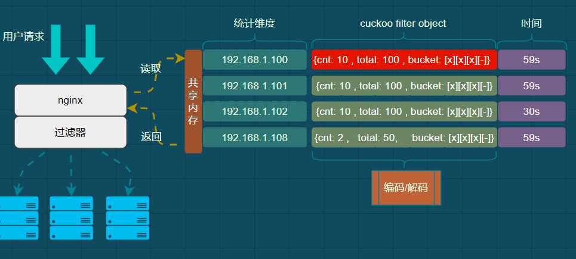
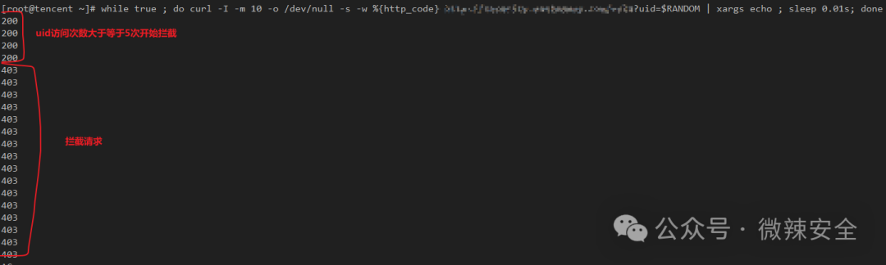
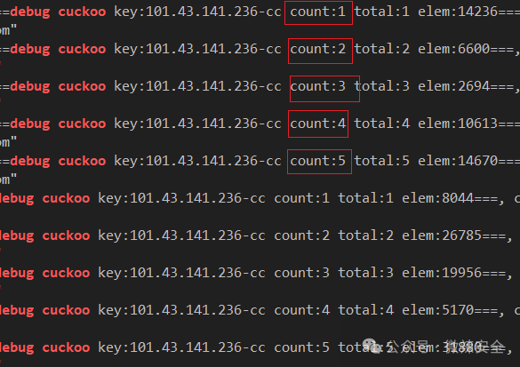

# Name
基于cuckoo_filter 动态流量分析算法 用户安全防护

## 安装
先要安装库和编译库文件 下面基于openresty安装

## 架构
原理架构图



```bash
git clone https://github.com/vela-security/x-limit-cuckoo.git
cd x-limit-cuckoo/cuckoo
bash build.sh  {openresty} # openresty 安装路径
cd ../
cp x_limit_cuckoo.lua  {openresty}/lualib/    # 安装x_limit_cuckoo.lua
```
## 配置样例
```nginx
# openresty 配置
...
lua_shared_dict cuckoo 10m;

location / {
    ...
    access_by_lua_block {
        local var , ctx = ngx.var , ngx.ctx
        local shm_name = "limit"
        local client   = "remote_addr"
        local second   = "arg_uid"    -- 记录请求uid
        local limit    = 10           -- 限制请求次数
        local count    = 5            -- 记录uid个数（不是次数）
        local time     = 60           -- 30s统计时长
        local lock     = 90           -- 达到限制后锁定多久
        local tag      = "cc"         -- 防止计数冲突 添加前缀
        
        local cuckoo = require "x_limit_cuckoo"
        local ret = cuckoo.access(shm_name, client , second , limit , count , time , lock , tag)
        if ret then
            ngx.exit(403) --拦截 
        end
    }

}

```

## 例子

请求测试

```bash
# bash 直接命令行运行即可
for (( c=1; c<=100; c++ )); do curl http://site.com/x?uid=$RANDOM; sleep 0.1s ;done
```
结果



日志

